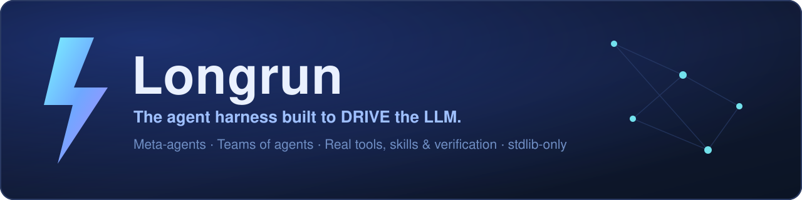

[](LICENSE)
[](https://www.python.org/)
[](#install--run)
[](#the-quality-gate)
[](https://github.com/jagones84/sparkforge/actions/workflows/ci.yml)

**SparkForge is a single agent harness — one engine that drives one LLM
extremely well.** Disciplined context, a real tool loop, evidence-gated task
tracking, verifier gates. **Then it runs that same harness as a team**: every
*session* it already runs **is** an agent — its own tools, skills, plan, memory
and transcript — and you **orchestrate those sessions as an org chart** (teams,
jobs, subjobs, todos). The coordinator delegates; the team executes in enforced
dependency order; the master synthesises the result.

> **Local-first · stdlib-only core (Python 3.10+) · one pure-Python dependency (PyYAML)**
> for the shipped YAML configs. One codebase runs on
> **Linux x86_64**, **Linux arm64/aarch64** (NVIDIA **DGX Spark** / GB10 Grace Blackwell,
> Ubuntu 24.04) and **Windows 10/11 (x64)**.

---

## Why SparkForge

|  | SparkForge |
|---|---|
| **One LLM, driven hard** | Context is *bounded* (tool-output offload, budget = the model's real window, auto-compact), not dumped. The model plans inline, acts with real tools, and closes steps **with evidence**. |
| **TEAMS of meta-agents** | A 5-level object model — Team → Job → Subjob → Agent → Todo — with a coordinator that decomposes a goal and hands **dependencies** to the team. |
| **Order is enforced** | `(after AX)` dependencies become a real DAG. A dependent agent does **not** start until its prerequisites finish. |
| **Nothing is closed as fake-done** | A step can only reach `done` with evidence; a worker that fails is marked **failed**, the job becomes **partial**, and the coordinator is *told* — it can't pretend success. |
| **It drives ANY model** | Local `llama.cpp` (Linux x86_64/arm64 + Windows), vLLM, OpenRouter, DeepSeek, OpenAI, Anthropic, Google — one `<provider>:<model>` reference, automatic fallback chain. |
| **Safe by construction** | Allowlist registry + per-action approval gate + a real sandbox (`docker`/`bwrap`/`nsjail`, `--network none`) so the agent never touches the host. |
| **Observable end to end** | Every delta, thought, tool call, delegation and todo change is streamed over SSE and persisted — you can *watch* the team work. |

**A single harness — not a "meta-harness".** A meta-harness is a collector that
orchestrates *other* harnesses; SparkForge has **one** engine. The agents it
orchestrates are simply *its own sessions*, organised into teams and an org chart
you can inspect and re-wire.

---

## The core idea: meta-agents in TEAMS

One clean object model, five levels, from a business goal down to a single checklist item:

```
T1  Team        ── a symbol + a roster (e.g. 🚀 Startup MVP Build)
└─ J12 Job      ── a goal given to a coordinator
   └─ J12.1 Subjob ── one assignment, bound to ONE agent, with deps (J12.1 → J12.2 …)
      └─ A25 Agent ── IS a session: its own harness, tools, skills, memory, chat
         └─ A25.n3 Todo ── a step, closable only with evidence
```

1. You give a **goal** to a **coordinator** (`POST /api/jobs {goal, assignee}`).
2. The coordinator's **plan turn is plan-only**: it reads the workspace, consults a
   skill if useful, records the plan, and **stops** — it cannot do the team's work.
3. The harness splits the plan into **subjobs**, enforces the declared `(after AX)`
   order, and runs the workers wave by wave.
4. Each worker runs a **full harness turn** — real tools, real skills, real files.
5. The coordinator receives the team report (with any **unfinished subjobs flagged**)
   and produces the final deliverable.

Teams can be seeded from an org chart, and **every team is scoped**: pick a team and
the orchestrator board, the chats, the constellation and the model policy all switch
to that team. A team is capped to **one local model per machine**; the rest use cheap
cloud models, and the strongest (still cheap) cloud goes to the leads.

---

## Feature highlights

**Harness (drives one LLM)**
- 💬 Streaming chat with a visible **Chain-of-Thought** timeline (`reasoning_content` / `<think>`).
- 🧩 **LLM-authored, evidence-gated task graph** — the model writes its own todos inline; `done` requires proof.
- 🔁 **Completion loop** with typed stops (`goal_reached · no_progress · budget · blocked`) — the list decides when work is done, not the model's mood.
- 🛠️ **Real tools**: `shell`, `fs.read/write/edit`, `git`, `http`, `web`, `memory`, `skills`, `sessions` (inspect another session's transcript), MCP tools — all through the approval gate.
- 🧠 **Memory** (store/recall/recent) auto-injected each turn; ⚠️ **checkpoints** + rollback.
- 📏 **Honest context meter** — the real prompt vs the model's real window (a **donut** breakdown by section), auto-compaction at 75%.
- 💰 **Live cost panel** — the provider's REAL per-call token usage priced per 1M: a running session total plus **one row per API call**. `↻ prices` pulls OpenRouter's public catalogue (no key); a local model reads as *unpriced*, never a fake zero.
- ▶️ **HITL** pause/resume/abort; ⏹️ Stop kills the actual tool process, not just the socket.

**Orchestration (drives a team)**
- 🗂️ **Teams · Jobs · Subjobs · Agents · Todos** — the object model above, first-class.
- 🧑✈️ **Plan-only coordinator turn** (read-only): the master plans, the workers execute.
- 🔗 **Enforced dependency waves** — a dependent subjob waits for its prerequisites.
- 🧾 **Bounded retry + escalation** — a `STATUS: BLOCKED` worker is retried a bounded number of times, then marked **failed** and surfaced to the master.
- 📡 **Both chats carry the hand-off** — the delegation appears in the coordinator's transcript *and* the worker's.
- 🔎 **Teammate inspection** — the master reads any teammate's full transcript (`sessions` tool: list → read) to understand *why* one is failing and help it.
- 🎛️ **Model policy per team** — ≤1 local/machine, cheap cloud for members, best cheap cloud for leads.
- 🧬 **Subagents** (in-loop delegation), **swarm/blackboard**, **ACP** interop — experimental.

**Interfaces**
- 🖥️ **WebUI** (`/`) — dark glassmorphism, live CoT, task graph, sessions labelled with their team.
- 🛰️ **Bridge** (`/orbit`) — the mission-control deck: **org chart, live constellation, job create/dispatch, team selector, model policy**, one column, mobile-style.
- ⌨️ **CLI** (`forge.py`) and a **mobile-ready HTTP API** — command the DGX from your phone over Tailscale.
- 🔌 **Bidirectional MCP** — use SparkForge *from* any MCP client, and connect *external* MCP servers as native tools.

All views share one theme — pick **Indigo / Dark / Midnight / Forest / Sand / Sepia** in ⚙ → Appearance (six eye-saver palettes).

---

## Install & run

**Requirements:** Python **3.10+**, plus **PyYAML** (pure-Python — no compiler, no
wheels) to read the shipped `config/*.yaml`. Nothing else: the core
(`src/sparkforge/`) imports only the standard library, and every heavier extra
(`numpy`, `sentence_transformers`, OpenTelemetry, `psutil`, the voice stack) is
optional and lazily guarded. The tool allowlist stays **fail-closed**: if PyYAML is
missing while `config/tools.yaml` exists, the harness refuses to start rather than
run with an unverified policy. You need an LLM: a local **llama.cpp router**
(default `http://127.0.0.1:8080`) or a cloud key in `.env`
(OpenRouter / DeepSeek / OpenAI / Anthropic / Google).

### Platforms

| Platform | Architecture | Status | Launcher |
|---|---|---|---|
| **Windows 10/11** | x64 | ✅ verified | `run.ps1` |
| **Linux** (Ubuntu 22.04+ & similar) | x86_64 | ✅ supported | `run.sh` |
| **Linux — NVIDIA DGX Spark** (GB10 Grace Blackwell, Ubuntu 24.04) | **arm64 / aarch64** | ✅ verified | `run.sh` |

The core is **pure stdlib** (PyYAML is its only third-party import, and it is
pure-Python), so there are no compiled wheels to build — any OS/architecture
with **CPython 3.10+** runs it identically. The only OS-specific code lives in one place,
[`src/sparkforge/osutil.py`](src/sparkforge/osutil.py): shell spawn
(`/bin/sh -c` ↔ `cmd /c`), process-tree kill (`SIGTERM/SIGKILL` ↔ `taskkill /T /F`) and
`PATH`/`PATHEXT` resolution (`npx` ↔ `npx.cmd`).

```bash
git clone https://github.com/jagones84/sparkforge && cd sparkforge
cp .env.template .env          # keys stay local (gitignored) — never commit them
./run.sh                       # WebUI + API on http://127.0.0.1:8790
./run.sh --host 0.0.0.0        # expose on the Tailscale/LAN IP for your phone
```

**Windows 10/11 (x64, native, no WSL):**

```powershell
git clone https://github.com/jagones84/sparkforge; cd sparkforge
Copy-Item .env.template .env
.\run.ps1                      # WebUI + API on http://127.0.0.1:8790
```

Open **`http://127.0.0.1:8790`** for the main app, or **`http://127.0.0.1:8790/orbit`**
for the mission-control deck. Auth (optional but recommended) is a bearer token:
`--token <t>` then `Authorization: Bearer <t>`.

**Always-on (Linux, systemd user unit):**

```bash
cp deploy/sparkforge.service ~/.config/systemd/user/
systemctl --user enable --now sparkforge.service
```

> Sandbox is optional: install `docker`, `bubblewrap` or `nsjail` for real isolation;
> otherwise shell commands run on the host and the topbar shows `sandbox: none (!)`.

---

## The quality gate

The **only** regression gate is one deterministic, fully-isolated battery — it points
every `SPARKFORGE_*` data dir at a throwaway temp dir, so it never touches live state:

```bash
bash tests/battery.sh        # → === battery: 117/117 GREEN ===
```

CI runs the same battery on every push/PR ([`.github/workflows/ci.yml`](.github/workflows/ci.yml)).
For the *live* seams (reload, session swap, swap-during-run, long tasks) see
[docs/TESTING-PLAYBOOK.md](docs/TESTING-PLAYBOOK.md).

---

## Documentation

| Doc | What |
|---|---|
| [docs/ARCHITECTURE.md](docs/ARCHITECTURE.md) | how the harness is wired (v1.0.0) |
| [docs/CLI.md](docs/CLI.md) | every CLI command + endpoint |
| [docs/TESTING-PLAYBOOK.md](docs/TESTING-PLAYBOOK.md) | how to hunt real bugs live |
| [docs/README.md](docs/README.md) | index of all docs (current vs historical) |
| [AGENTS.md](AGENTS.md) | orientation for an AI agent landing in the repo |
| [CONTRIBUTING.md](CONTRIBUTING.md) | how to contribute |
| [CHANGELOG.md](CHANGELOG.md) | release notes |

---

## License

© 2025–2026 Giovanni J. Agones ([jagones84](https://github.com/jagones84)).
Licensed under **AGPL-3.0** — see [LICENSE](LICENSE).

If SparkForge is useful to you, ⭐ star the repo — it helps others find it.
